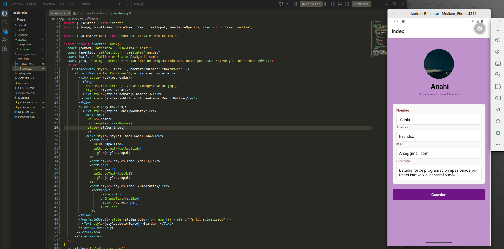
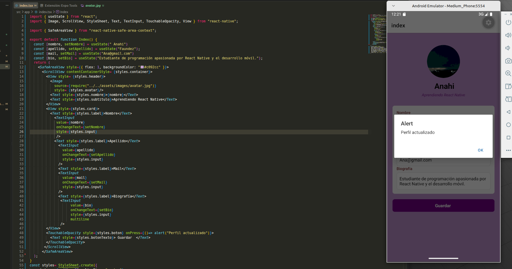
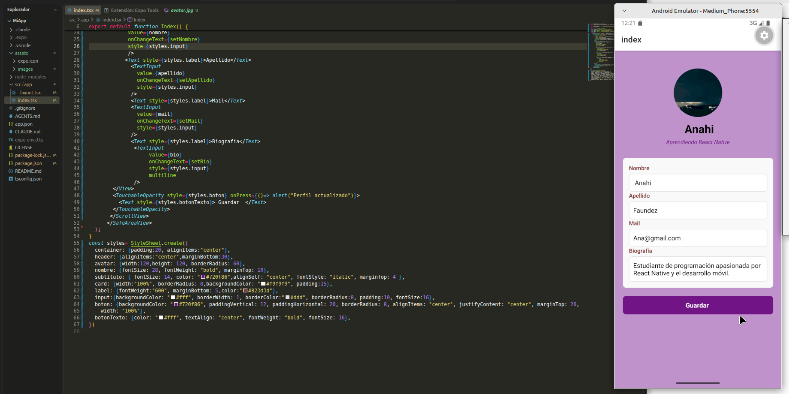

# Pantalla de Perfil - React Native & Expo

**Proyecto:** Primera Entrega — App de Perfil de Usuario

---

## 📱 Características y Componentes
- **Componentes Base y Nativos:** Uso de `SafeAreaView`, `ScrollView`, `Text`, `TextInput` y `TouchableOpacity`.
- **Entrada Multilinea:** Campo de **Biografía** configurado con `multiline={true}` y `textAlignVertical="top"`.
- **Diseño y Estilos:** Estructura limpia mediante `StyleSheet`, layout con `Flexbox`, contenedores tipo tarjeta (`card`) y avatar circular.
---

## 📷 Capturas de Pantalla

> *Ubica tus capturas dentro de la carpeta `screenshots/` en la raíz del proyecto para que se visualicen correctamente.*

| Vista Principal | Formulario | Teclado Activo |
| :---: | :---: | :---: |
|  |  |  |

---

## 🚀 Cómo ejecutar el proyecto

1. **Clonar el repositorio:**
 ```bash
   git clone https://github.com/Anahi1985/mi-perfil-react-native.git
   cd mi-perfil-react-native

